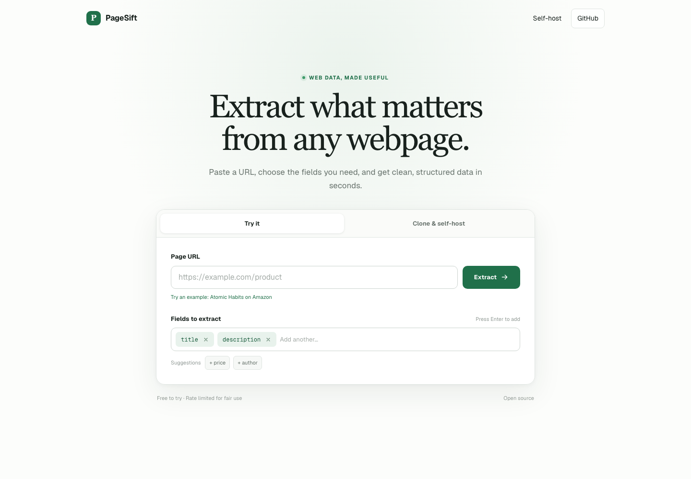

# PageSift

PageSift turns webpages into structured JSON. Paste a public URL, choose the
fields you need, and let an OpenAI-compatible model extract the values.



## Run it yourself

```bash
git clone https://github.com/Iltwats/pagesift.git
cd pagesift
npm install
npx playwright install
cp .env.example .env.local
```

Add your OpenRouter key to `.env.local`:

```env
AI_API_KEY=your_openrouter_api_key
AI_BASE_URL=https://openrouter.ai/api/v1
AI_MODEL=google/gemini-3.1-flash-lite
```

Start PageSift:

```bash
npm run dev
```

Open [http://localhost:3000](http://localhost:3000).

## API

The same extractor is available at `POST /api/extract`:

```json
{
  "url": "https://example.com/product",
  "fields": ["title", "price", "description"]
}
```
